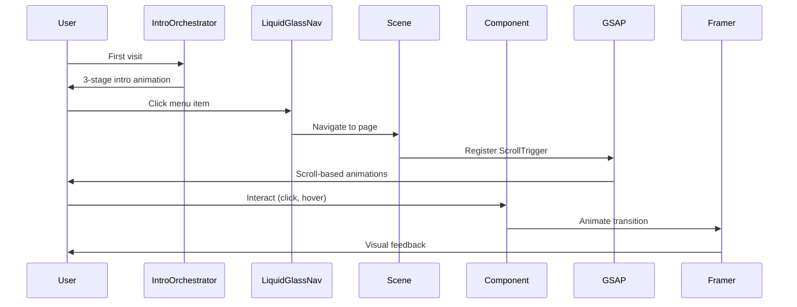
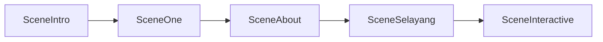

# 🌌 INFINITY - Edufest 2025

<div align="center">


**The 8th Annual Fithrah Insani Education Festival 2025**

*"Growing Talents Beyond Infinity"*

🔗 **[Kunjungi Website](https://infinity.biezz.my.id)** | 📂 **[GitHub Repository](https://github.com/biezz-2/infinity-edufest)**

</div>

---

## 🎯 Table of Contents

| Section | Description |
|---------|-------------|
| [📖 About Project](#-about-project) | Overview dan tema event |
| [✨ Key Features](#-key-features) | Fitur utama dan teknologi |
| [🛠 Tech Stack](#-tech-stack) | Detail framework dan library |
| [🏗️ Architecture](#️-architecture) | Arsitektur sistem dan diagram |
| [📁 Project Structure](#-project-structure) | Struktur folder proyek |
| [🚀 Getting Started](#-getting-started) | Panduan instalasi dan pengembangan |
| [🎨 Design System](#-design-system) | Palet warna, tipografi, dan efek |
| [📄 Pages Overview](#-pages-overview) | Penjelasan setiap halaman |
| [🔧 Component Reference](#-component-reference) | Dokumentasi komponen |
| [📊 Stats](#-stats) | Metrik proyek |

---

## 📖 About Project

### Event Overview

**INFINITY - Edufest 2025** adalah acara tahunan ke-8 yang diselenggarakan oleh SMA IT Fithrah Insani dan SMK Informatika Fithrah Insani. Event ini mewadahi bakat kreatif siswa SMP/MTs dalam bidang Pendidikan dan Teknologi.

### Theme: INFINITY

Tema **"Ketakterbatasan Potensi Bakat Remaja"** diangkat karena kekhawatiran mengenai remaja Indonesia yang takut mencoba hal baru, keluar dari zona nyamannya, dan malu peduli dengan lingkungan sekitar.

### Tagline

> *"Amazing Intelligence, Delightful Entertain and Humanity"*

### Event Details

| Detail | Information |
|--------|-------------|
| **Tanggal** | 13-14 Februari 2025 |
| **Lokasi** | SMA dan SMK Fithrah Insani |
| **Target Peserta** | 1.500 (Peserta & Audiens) |
| **Guest Star** | Fajri (Unity), Zein Permana, Ray Shareza |

---

## ✨ Key Features

### 🔳 Intro Orchestrator (3 Stages)

Sistem intro tiga tahap yang menciptakan pengalaman pengguna yang memukau dengan transisi seamless:

| Stage | File | Fungsi |
|-------|------|--------|
| `LoaderStage` | [`LoaderStage.tsx`](components/intro/LoaderStage.tsx) | Loading screen dengan infinity progress indicator |
| `WireframeStage` | [`WireframeStage.tsx`](components/intro/WireframeStage.tsx) | Preview struktur halaman dengan efek wireframe |
| `RevealStage` | [`RevealStage.tsx`](components/intro/RevealStage.tsx) | Animasi reveal logo dengan efek dramatis |

**Fitur:**
- ⏱️ Skip on revisit (user yang sudah pernah visit tidak perlu lihat intro lagi)
- 📊 Progress tracking dengan GSAP
- 🎬 Smooth easing animations (expo.out, power4.out)

### 🖱️ Cursor Particles

Sistem partikel kursor berbasis Canvas dengan algoritma **Poisson Disk Sampling**:

```typescript
// Konfigurasi default
const config = {
  particleCount: depends on screen size,
  minDistance: 45,
  repelRadius: 150,
  repelStrength: 0.8,
  springStrength: 0.08,
  friction: 0.88,
  colors: ['#4285F4', '#EA4335', '#FBBC05', '#34A853', '#60a5fa', '#a78bfa']
}
```

**Fitur:**
- ✦ 6 warna harmonis (Google colors + variants)
- ✦ Physics-based movement dengan spring force
- ✦ Efek magnet dan repulsif pada kursor
- ✦ Performant dengan `requestAnimationFrame`
- ✦ Responsive pada resize window

**Implementasi:** [`CursorParticles.tsx`](components/CursorParticles.tsx) | [`poisson-disk.ts`](lib/poisson-disk.ts)

### 🎵 Audio Manager

Sistem manajemen audio dengan:

- 🔊 Ambient background music
- ⏩ Fade-in/out transitions
- 🔇 Mute/unmute control
- 🎶 Seamless looping
- ⏱️ Auto-mute saat intro berlangsung

**Implementasi:** [`AudioManager.tsx`](components/AudioManager.tsx)

### 🫧 Liquid Glass Navigation

Navigasi dengan efek **glassmorphism** modern dengan mouse tracking:

```typescript
// Mouse tracking untuk liquid reflection
const x = useMotionValue(0);
const y = useMotionValue(0);

const background = useMotionTemplate`
  radial-gradient(
    140px circle at ${x}px ${y}px,
    rgba(255,255,255,0.18),
    rgba(255,255,255,0.08) 40%,
    transparent 70%
  )
`;
```

**Fitur:**
- 🌫️ Backdrop blur 24px-32px
- 💧 Mouse tracking liquid reflection
- ✨ Transparent overlay dengan noise texture
- 🎯 Smooth hover transitions
- 📱 Responsive dengan AnimatePresence

**Implementasi:** [`LiquidGlassNav.tsx`](components/ui/LiquidGlassNav.tsx)

### 📜 Smooth Scrolling

Implementasi **Lenis scroll** dengan konfigurasi premium:

```typescript
// lib/lenis.ts
const lenis = new Lenis({
  duration: 1.2,
  easing: (t) => Math.min(1, 1.001 - Math.pow(2, -10 * t)),
  orientation: 'vertical',
  gestureOrientation: 'vertical',
  smoothWheel: true,
});
```

**Fitur:**
- ⚡ 1.2s duration dengan exponential easing
- 🖱️ Gesture support (touchpad/mouse wheel)
- 🔄 Sync dengan GSAP ScrollTrigger
- 📱 Mobile responsive

### 🌐 Globe Visualization

Visualisasi interaktif menggunakan **D3.js** + **TopoJSON**:

```typescript
// GlobeToMapTransform.tsx
- Auto-rotation globe
- Smooth zoom/pan controls
- TopoJSON country data rendering
- Transition to flat map view
```

**Fitur:**
- 🌍 3D globe dengan auto-rotation
- 📍 Interactive hover effects
- 🎨 TopoJSON data rendering
- ✨ Smooth D3 transitions
- 🗺️ Transform ke map view

**Implementasi:** [`GlobeToMapTransform.tsx`](components/globe/GlobeToMapTransform.tsx)

### 📅 Timeline Page

Halaman perjalanan event dari 2017-2026:

| Year | Date | Theme |
|------|------|-------|
| 2017 | 19 Feb | Pentas Seni, Perlombaan, Penggalangan Dana |
| 2018 | 16-17 Feb | It's Time To Shine |
| 2019 | 16-17 Feb | Prove Our Ability Show Our Creativity |
| 2020 | 14 Feb | ANAGATA: Today For The Future |
| 2023 | 13-14 Feb | Universe: Be The Best In The Universe |
| 2024 | 18-19 Feb | Unity: Unity In Diversity |
| 2025 | 13-14 Feb | **Aidentity: INFINITY** |
| 2026 | 13-14 Feb | Infinity: To Be Continued |

**Fitur:**
- 📆 Chronological event display
- 🎭 Beautiful guest profile cards
- 📱 Fully responsive design
- 🔗 Smooth scroll animations
- 🎨 Dark theme aesthetic

### 👥 Committee Page

Halaman struktur organisasi dengan **80+ anggota** di **11 divisi**:

| Division | Coordinator | Members |
|----------|-------------|---------|
| **Panitia Inti** | - | 4 (Ketum, Waket, Sek, Bend) |
| Divisi Acara | Surya SIGIT | 9 |
| Divisi Lomba | Shyfa Putri Azzahra | 10 |
| Konsumsi & P3K | Kayyisa Fathiyyah | 7 |
| Humas | Jasmine Vanya Aberka | 7 |
| Kesekretariatan | Rizka Rasyidah | 6 |
| Keamanan | Abdurrahman Taqi Prasetyo | 8 |
| Pubdok | Keysha Nafidha Almira Gunawan | 8 |
| LO | Adhiena Zahra Rizkya | 8 |
| Danus | Kezzia Annisa Salsabila | 7 |
| Artistik | Banita Aliya Asrofa | 7 |

**Fitur:**
- 🌳 Tree view visualization
- 📋 Division cards
- 👤 Member profiles dengan initials fallback
- 🔍 Click-to-preview ID card (modal besar)
- 🖼️ Auto-slide photo gallery (3 detik)
- ⏸️ Pause on hover untuk slider
- 🎨 Color-coded roles (Ketum=Warna Emas, dll)

### 📸 Ticker Gallery

Infinite scroll image gallery dengan CSS animations:

**Fitur:**
- 🔄 Auto-scroll dengan 3 track
- ⏸️ Pause pada hover
- 📱 Responsive breakpoints
- 🎬 Smooth CSS transitions

**Implementasi:** [`TickerGallery.tsx`](components/TickerGallery.tsx) | [`TickerGallery.module.css`](styles/TickerGallery.module.css)

### 🎨 Scene Animations (GSAP ScrollTrigger)

5 scene utama dengan scroll-triggered animations:

| Scene | File | Animation Type |
|-------|------|----------------|
| Intro | [`SceneIntro.tsx`](components/scenes/SceneIntro.tsx) | Logo reveal, scale, blur |
| One | [`SceneOne.tsx`](components/scenes/SceneOne.tsx) | Horizontal scroll text |
| About | [`SceneAbout.tsx`](components/scenes/SceneAbout.tsx) | Zoom in/out + fade |
| Selayang | [`SceneSelayang.tsx`](components/scenes/SceneSelayang.tsx) | Slide + fade sequence |
| Interactive | [`SceneInteractive.tsx`](components/scenes/SceneInteractive.tsx) | Ticker + Magnetic Button |

### 🧲 Magnetic Button

Button dengan efek magnetik mengikuti kursor:

**Implementasi:** [`MagneticButton.tsx`](components/ui/MagneticButton.tsx)

---

## 🛠 Tech Stack

| Category | Technology | Version | Purpose |
|----------|------------|---------|---------|
| **Framework** | [Next.js](https://nextjs.org/) | 16.1.1 | App Router, SSR |
| **Language** | [TypeScript](https://www.typescriptlang.org/) | 5.x | Type safety |
| **Styling** | [Tailwind CSS](https://tailwindcss.com/) | v4 | Utility-first CSS |
| **Animations** | [GSAP](https://greensock.com/gsap/) | 3.14.2 | ScrollTrigger, Timeline |
| | [Framer Motion](https://www.framer.com/motion/) | 12.23.26 | UI transitions |
| | [Lenis](https://lenis.studio/) | 1.3.16 | Smooth scrolling |
| **Data Viz** | [D3.js](https://d3js.org/) | 7.9.0 | Globe visualization |
| | [TopoJSON Client](https://github.com/topojson/topojson-client) | 3.1.0 | Geo data handling |
| **Icons** | [Lucide React](https://lucide.dev/) | 0.562.0 | Icon system |
| **Fonts** | [Inter](https://fonts.google.com/specimen/Inter) | - | Body text |
| | [Audiowide](https://fonts.google.com/specimen/Audiowide) | - | Display headings |
| | [Poppins](https://fonts.google.com/specimen/Poppins) | - | Section titles |

---

## 🏗️ Architecture

```mermaid
graph TB
    subgraph Next.js App Router
        subgraph Pages
            Home["/ - Home Page"]
            Timeline["/timeline"]
            Panitia["/panitia"]
            Location["/location"]
        end
    end

    subgraph Components
        subgraph Scenes
            SceneIntro
            SceneOne
            SceneAbout
            SceneSelayang
            SceneInteractive
        end

        subgraph Intro System
            IntroOrchestrator
            LoaderStage
            WireframeStage
            RevealStage
        end

        subgraph UI Components
            LiquidGlassNav
            MagneticButton
            CursorParticles
            LoadingScreen
        end

        subgraph Feature Components
            TimelineOrchestrator
            TickerGallery
            GlobeToMapTransform
            AudioManager
        end
    end

    subgraph Data Layer
        committee.ts["committee.ts - 80+ members"]
        timelineData["Timeline history 2017-2026"]
    end

    subgraph Animation Layer
        GSAP["GSAP + ScrollTrigger"]
        Framer["Framer Motion"]
        Lenis["Lenis Smooth Scroll"]
    end

    Home --> Scenes
    Timeline --> TimelineOrchestrator
    Location --> GlobeToMapTransform
    panitia --> committee.ts

    Scenes --> GSAP
    LiquidGlassNav --> Framer
    CursorParticles --> Canvas API
```

### Data Flow



---

## 📁 Project Structure

```
infinity-edufest/
├── app/                          # Next.js App Router
│   ├── layout.tsx               # Root layout dengan Lenis, Nav, Audio
│   ├── page.tsx                 # Home page (5 scenes)
│   ├── globals.css              # Global styles + Tailwind
│   ├── timeline/
│   │   └── page.tsx             # Timeline page
│   ├── panitia/
│   │   └── page.tsx             # Committee page (80+ members)
│   └── location/
│       └── page.tsx             # Location + Globe page
│
├── components/
│   ├── scenes/                  # Landing page scenes
│   │   ├── SceneIntro.tsx       # Logo reveal
│   │   ├── SceneOne.tsx         # Horizontal scroll text
│   │   ├── SceneAbout.tsx       # About Edufest
│   │   ├── SceneSelayang.tsx    # Selayang Pandang
│   │   ├── SceneInteractive.tsx # Ticker + CTA
│   │   ├── SceneVisual.tsx      # Visual showcase
│   │   └── SceneOutro.tsx       # Footer CTA
│   │
│   ├── intro/                   # Intro sequence
│   │   ├── IntroOrchestrator.tsx
│   │   ├── LoaderStage.tsx
│   │   ├── WireframeStage.tsx
│   │   └── RevealStage.tsx
│   │
│   ├── ui/                      # Generic UI elements
│   │   ├── CursorParticles.tsx  # Canvas particles
│   │   ├── LiquidGlassNav.tsx   # Glassmorphism nav
│   │   ├── MagneticButton.tsx   # Magnetic button
│   │   ├── LoadingScreen.tsx
│   │   ├── InfinityLoader.tsx
│   │   ├── PageLoader.tsx
│   │   └── PageTransitionLoader.tsx
│   │
│   ├── timeline/                # Timeline components
│   │   ├── TimelineOrchestrator.tsx
│   │   └── TimelineItem.tsx
│   │
│   ├── globe/                   # Globe visualization
│   │   └── GlobeToMapTransform.tsx
│   │
│   ├── TickerGallery.tsx        # Infinite scroll gallery
│   ├── AudioManager.tsx         # Background audio
│   ├── Slider.tsx               # Image slider
│   ├── Footer.tsx               # Footer component
│   └── CursorParticles.tsx      # Canvas particles
│
├── data/                        # Static data
│   └── committee.ts             # 80+ committee members
│
├── lib/                         # Utilities
│   ├── gsap.ts                  # GSAP hooks
│   ├── lenis.ts                 # Smooth scroll setup
│   ├── poisson-disk.ts          # Poisson Disk Sampling
│   └── utils.ts                 # Helper functions
│
├── public/                      # Static assets
│   ├── images/                  # Image files
│   ├── sounds/                  # Audio files
│   └── assets/
│       ├── noise.png            # Noise texture
│       ├── loading-infinity/    # Loading assets
│       ├── panitia/             # Committee photos
│       └── timeline/            # Timeline guest photos
│
├── styles/                      # CSS Modules
│   ├── Slider.module.css
│   ├── TickerGallery.module.css
│   └── CursorParticles.module.css
│
├── next.config.ts               # Next.js configuration
├── package.json                 # Dependencies
├── tailwind.config.ts           # Tailwind config
├── tsconfig.json                # TypeScript config
└── README.md                    # This file
```

### Component Categories

```
components/
├── scenes/              → Landing page sections (5 scenes)
├── intro/               → Intro sequence (3 stages)
├── ui/                  → Reusable UI (nav, buttons, loaders)
├── timeline/            → Timeline specific components
└── globe/               → Globe visualization
```

---

## 🚀 Getting Started

### Prerequisites

| Requirement | Minimum Version |
|-------------|-----------------|
| Node.js | 18.0.0+ |
| npm | 9.0.0+ |
| git | 2.0.0+ |

### Installation

```bash
# Clone repository
git clone https://github.com/biezz-2/infinity-edufest.git

# Navigate to project directory
cd infinity-edufest

# Install dependencies
npm install

# Start development server
npm run dev

# Or start on LAN (for testing on other devices)
npm run dev:lan

# Build for production
npm run build

# Start production server
npm run start
```

### Available Scripts

| Command | Description |
|---------|-------------|
| `npm run dev` | Start development server di localhost:3000 |
| `npm run dev:lan` | Start development server di 0.0.0.0:3000 |
| `npm run build` | Build untuk production |
| `npm run start` | Start production server |
| `npm run lint` | Run ESLint |

### Environment Variables

Buat file `.env.local` jika diperlukan:

```env
NEXT_PUBLIC_API_URL=https://api.example.com
```

---

## 🎨 Design System

### Color Palette

| Name | Hex | RGB | Usage |
|------|-----|-----|-------|
| **Primary Background** | `#f8f9fd` | 248, 249, 253 | Main background |
| **Background Accent** | `#78a0d4` | 120, 160, 212 | Gradient accents |
| **Foreground** | `#171717` | 23, 23, 23 | Primary text |
| **Card** | `#ffffff` | 255, 255, 255 | Card backgrounds |
| **Border** | `#e6e6e6` | 230, 230, 230 | Border colors |
| **Muted** | `#f0f0f0` | 240, 240, 240 | Secondary backgrounds |
| **Muted Foreground** | `#737373` | 115, 115, 115 | Secondary text |

### Dark Theme (Timeline)

| Name | Hex | Usage |
|------|-----|-------|
| **Dark Background** | `#0a0a0a` | Timeline background |
| **Purple Accent** | `#a78bfa` | Timeline accents |
| **Blue Accent** | `#60a5fa` | Secondary accents |
| **Gradient Text** | Purple → White → Blue | Headings |

### Typography

| Font | Weight | Usage |
|------|--------|-------|
| **Inter** | 400, 500, 600, 700 | Body text, UI elements |
| **Audiowide** | 400 | Display headings, logos |
| **Poppins** | 300, 400, 600, 800 | Section headings, titles |

### Glassmorphism Effects

```css
/* Light glass */
.glass-light {
  background: rgba(255, 255, 255, 0.1);
  backdrop-filter: blur(24px);
  border: 1px solid rgba(255, 255, 255, 0.2);
}

/* Dark glass (Timeline) */
.glass-dark {
  background: rgba(255, 255, 255, 0.05);
  backdrop-filter: blur(32px);
  border: 1px solid rgba(255, 255, 255, 0.1);
}

/* Noise texture overlay */
.glass-noise {
  background-image: url('/assets/noise.png');
  opacity: 0.03;
}
```

### Animations

| Animation | Type | Duration | Usage |
|-----------|------|----------|-------|
| Intro Reveal | expo.out | 1.5s | Logo reveal |
| Text Slide | power4.out | 1.2s | Text animations |
| Page Transition | spring | 0.4s | Modal open/close |
| Nav Dropdown | spring | 0.3s | Menu animations |

---

## 📄 Pages Overview

### 🏠 Home Page (`/`)

Halaman utama dengan 5 scene interaktif:



| Scene | Height | Animation | Content |
|-------|--------|-----------|---------|
| Intro | 100vh | Logo reveal, blur | Logo, tagline, scroll indicator |
| One | 300vh | Horizontal scroll | "potential • hope • opportunity" |
| About | 400vh | Zoom in/out | About Edufest description |
| Selayang | 500vh | Slide + fade | Theme overview, history |
| Interactive | min-h-screen | Fade in | Ticker gallery, CTA button |

**Components:** [`SceneIntro.tsx`](components/scenes/SceneIntro.tsx) → [`SceneOne.tsx`](components/scenes/SceneOne.tsx) → [`SceneAbout.tsx`](components/scenes/SceneAbout.tsx) → [`SceneSelayang.tsx`](components/scenes/SceneSelayang.tsx) → [`SceneInteractive.tsx`](components/scenes/SceneInteractive.tsx)

### 📅 Timeline Page (`/timeline`)

Halaman perjalanan event dengan:

- 📆 8 tahun history (2017-2026)
- 🎭 Guest profile cards dengan foto
- 🎨 Dark theme aesthetic
- ✨ Smooth scroll animations
- 📱 Mobile responsive

**Components:** [`TimelineOrchestrator.tsx`](components/timeline/TimelineOrchestrator.tsx) → [`TimelineItem.tsx`](components/timeline/TimelineItem.tsx)

### 👥 Committee Page (`/panitia`)

Halaman struktur organisasi dengan:

- 🌳 Tree view visualization
- 🎯 Color-coded roles (Ketum/Waket/Sek/Bend)
- 📸 ID Card modal dengan photo slider
- ⏱️ Auto-slide setiap 3 detik
- ⏸️ Pause on hover
- 🔘 Dot indicator
- 🖼️ Dual photo support (profile + card)

**Data:** [`committee.ts`](data/committee.ts) - 11 divisi, 80+ anggota

### 🌍 Location Page (`/location`)

Halaman lokasi dengan:

- 🌍 D3.js globe visualization
- ✨ Auto-rotation animation
- 🗺️ Transform ke Google Maps
- 📍 Embed Google Maps iframe
- 🎨 Responsive design

**Components:** [`GlobeToMapTransform.tsx`](components/globe/GlobeToMapTransform.tsx)

---

## 🔧 Component Reference

### Animation Hooks

```typescript
// lib/gsap.ts
export function useGSAP(
  callback: (gsap: GSAP, ScrollTrigger?: ScrollTrigger) => void,
  dependencies?: DependencyList
): void
```

### Committee Data Types

```typescript
// data/committee.ts
type CommitteeType = "core" | "division";

interface Member {
  id: string;
  role?: string;
  name: string;
  photo?: string;
  photos?: string[]; // Array of photos for slider
}

interface Division {
  id: string;
  label: string;
  type: CommitteeType;
  coordinator?: string;
  members: Member[] | string[];
}
```

### Timeline Data

```typescript
interface TimelineEvent {
  year: string;
  date: string;
  theme: string;
  participants: string;
  guests: {
    name: string;
    src: string;
    objectPosition?: string;
  }[];
}
```

---

## 📊 Stats

<div align="center">

| Metric | Value |
|--------|-------|
| 🗓️ Years of History | **8** (2017-2026) |
| 👥 Committee Members | **80+** |
| 📂 Divisions | **11** |
| 🎬 Scenes | **5** |
| 📄 Pages | **4** |
| 🎨 Animations | **50+** |
| 🔧 Components | **25+** |

---

## 🤝 Contributing

Kami terbuka untuk kontribusi! Silakan:

1. Fork repository ini
2. Buat feature branch (`git checkout -b feature/amazing-feature`)
3. Commit perubahan (`git commit -m 'Add amazing feature'`)
4. Push ke branch (`git push origin feature/amazing-feature`)
5. Buat Pull Request

### Development Guidelines

- Gunakan TypeScript untuk semua komponen baru
- Ikuti pattern yang sudah ada di codebase
- Test responsivitas pada berbagai device
- Gunakan `npm run lint` sebelum commit

---

## 📝 License

MIT License - lihat file [LICENSE](LICENSE) untuk detail.

---

## 🙏 Acknowledgments

- **GSAP** untuk animation library yang powerful
- **Tailwind CSS** untuk utility-first styling
- **Next.js** untuk React framework
- **Framer Motion** untuk smooth transitions
- **D3.js** untuk data visualization

---

<div align="center">

**Made by Biezz**

*Infinity Edufest 2025 - Growing Talents Beyond Infinity*

🌐 [infinity.biezz.my.id](https://infinity.biezz.my.id)

</div>
